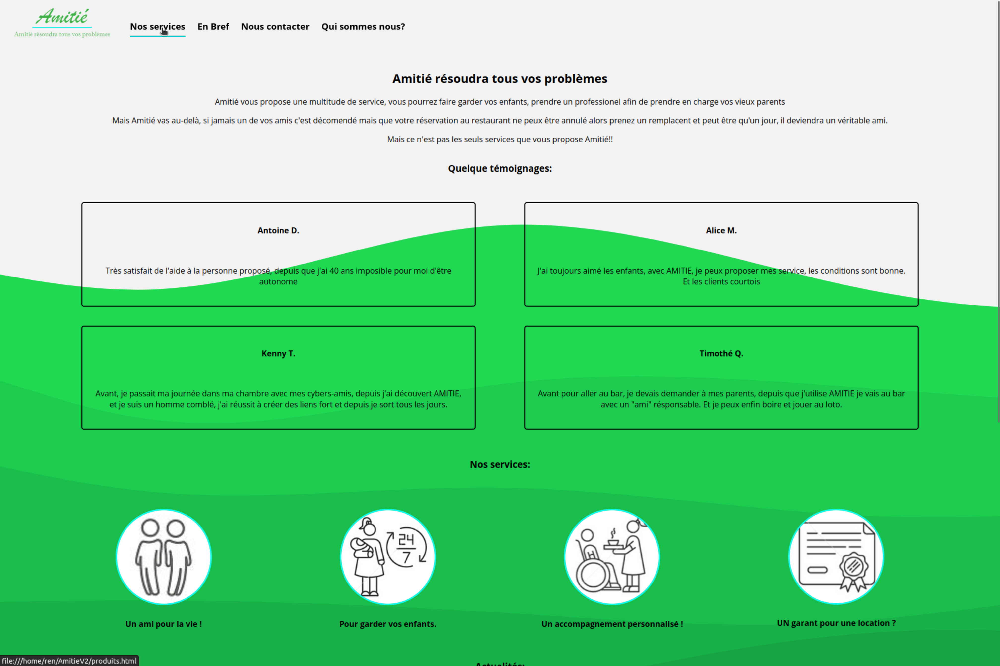

# AmitieV2

Un design visuel d'un site web vendant des services (dans notre cas, on propose des services de baby-sitting, etc).

Ce projet est la 2ème version d'un projet effectué à l'IUT d'Orsay qu'on a décidé de peaufiner sur notre temps libre pour avoir un rendu plus propre et plus professionnel, pour être davantage satisfait de notre travail.

Il contient le même contenu que la 1ère version mais la présentation est davantage peaufiné et le design plus réfléchi.

Les dossiers contenant les différents fichiers HTML et CSS ont été triés et rangés de sorte à être le plus compréhensibles et simplifiées.

Voici quelques screens : 

